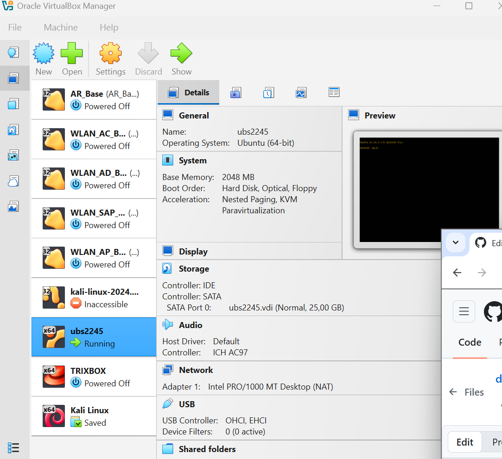

Langkah yang Harus Dilakukan: 
Pertama kita melakukan login pada ubuntu ubs 64bit
Konfigurasi Asterisk pada Ubuntu.
Tambahkan user/extension dengan ketentuan berikut:
Username: Nama lengkap atau nama depan
Extension (Nomor internal): empat digit terakhir NIM (contoh: jika NIM = 607052430017, maka extension = 0017)

 
membuat Push ke repositori dengan aturan branching berikut:
Format nama branch: nama-nim
Contoh: Khairul-0017, seperti gambar dibawah ini:

